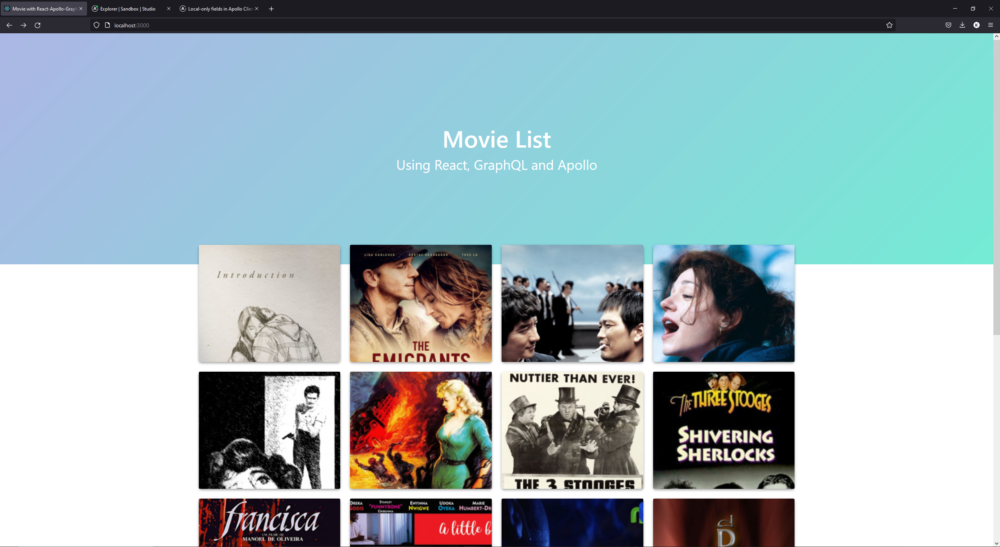
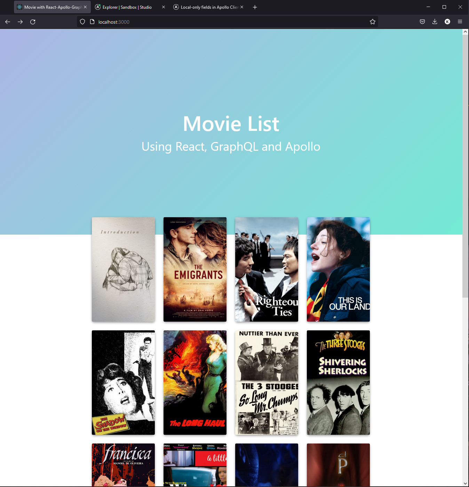
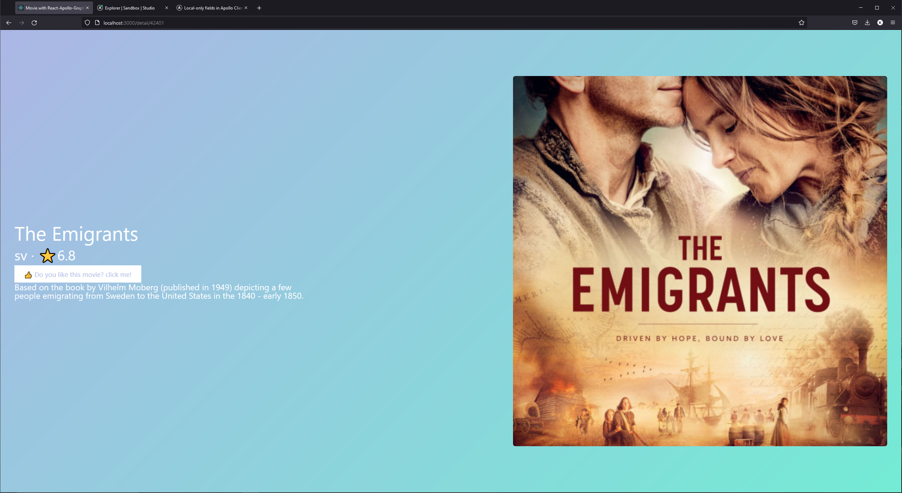
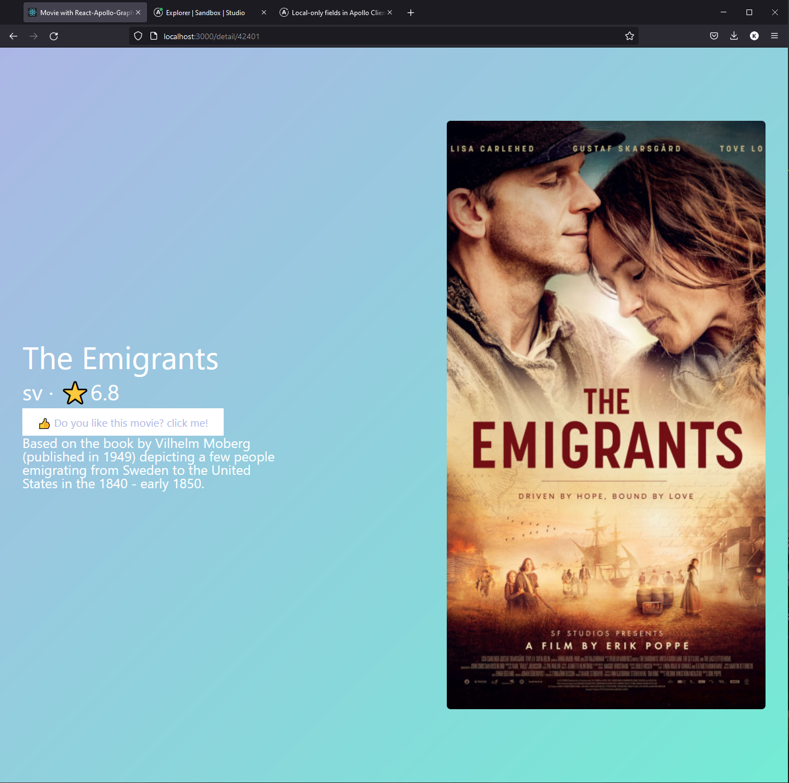
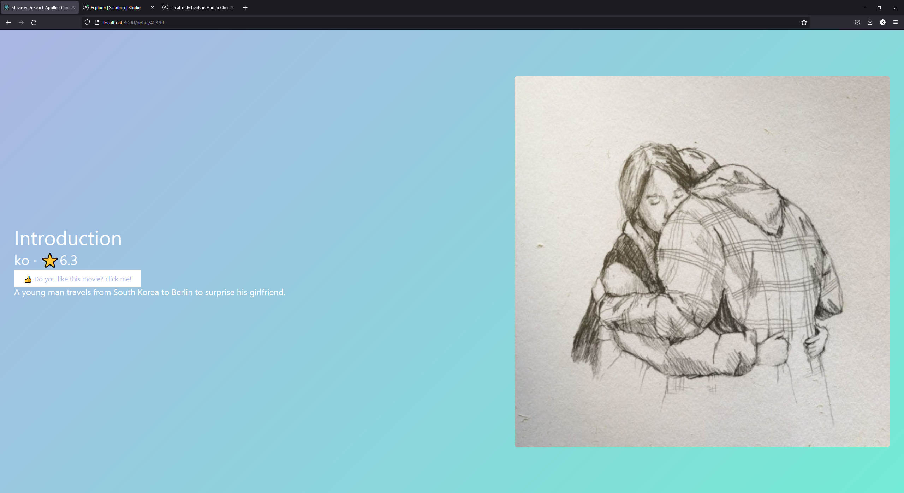

# React and GraphQL

Build a movie app with React, Apollo and GraphQL
[API](https://github.com/HaesunJo/study_graphQL)


### set up


```bash
npm i styled-components react-router-dom @apollo/client graphql
```


### useQuery

ApolloPrivider in index.js allow to access to the client


```javascript
// set up apollo
const root = ReactDOM.createRoot(document.getElementById('root'));
root.render(
  <React.StrictMode>
    <ApolloProvider client={client}>
      <App />
    </ApolloProvider>
  </React.StrictMode>
);
```


#### Imperative code
write down every step of the code
working without useQuery(), will be like this all the time:

```javascript
const [hello, setHello] = useState([]);
const client = useApolloClient();
useEffect(() => {
    client.query({
        query: gql`
            {
               queryName {
                   id
                   title
                   image_link
               }
            }
        `,
    }).then((result) => setTitle(result.data.hello));
}, [client]);

return (
    <ul>
        {hello.map((h) => (<li key={h.id}>{h.title}</li>))}
    </ul>
)
```


#### Declartive code
Hook allows to use declartive code that write code to explain and express what you want
Working with uesQuery will be like:

- what can we get from useQuery()?
    - client : ApolloClient<any>
    - data : TData | undefined
    - previouseData : data
    - error : ApolloError
    - loading : boolean
    - networkStatus : NetworkStatus
    - called : boolean


```javascript
const GET_DATA = gql`
{
    queryName {
        id
        title
        image_link
    }
}
`;

const { loading, data, error } = useQuery(GET_DATA);

if (loading) return "Data fetching...";
if (error) return "ERROR! cannot fetch!";

return (
    <ul>
        {data.queryName.map((q) => (<li key={q.id}>{q.title}</li>))}
    </ul>;
)

```


## Result

### Main page





### Detail page




### Like button

